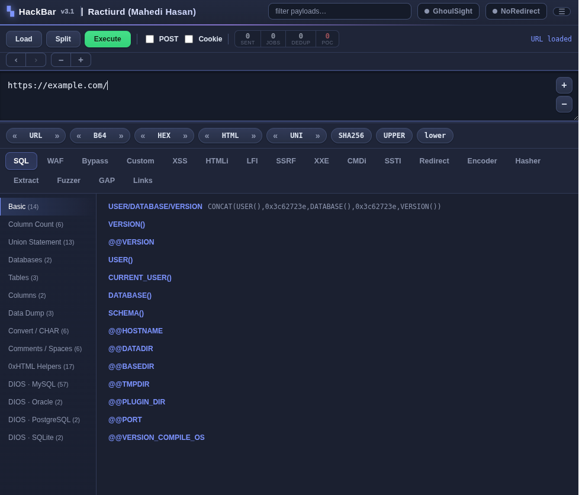

# HackBar - by Ractiurd (Mahedi Hasan)

## The Legendary Firefox Penetration Testing Tool, Reborn for the Chromium Era

HackBar is a modern browser-based penetration testing toolbar rebuilt for Chromium browsers.

Designed for **bug bounty hunters, CTF players, and security researchers**, HackBar provides payload libraries, encoding tools, request manipulation, reconnaissance features, and security testing utilities directly inside your browser.

> Warning: HackBar is intended only for authorized security testing, educational purposes, CTF competitions, and legitimate security research.

---


### Version 3.1 Features

| Feature | Description |
| :--- | :--- |
| GhoulSight | External XSS scanner integration with verified results and PoC reporting |
| GAP Recon | Link, parameter, and word extraction inspired by Burp GAP |
| Custom Payloads | Save, import, export, and manage custom payload collections |
| Admin Fuzzer | Multi-threaded directory and file fuzzing |
| NoRedirect | Redirect blocking with custom rules and regex support |
| Encoder Tools | URL, Base64, Hex, HTML, Unicode and more |
| Smart Navigation | URL history and parameter manipulation helpers |


---




## Core Capabilities

### The Armory (Payload Libraries)

HackBar includes payload collections for:

`SQL Injection` • `XSS` • `HTML Injection` • `LFI` • `SSRF` • `XXE` • `Command Injection` • `SSTI` • `Open Redirect` • `WAF bypass techniques`

---

## The Workbench

### Encoders / Decoders

`URL` • `Base64` • `Hex` • `HTML` • `Unicode` • `JWT utilities` • `ROT13` • `Reverse`

### Hashers

`MD5` • `SHA-1` • `SHA-256` • `SHA-384` • `SHA-512`

---

## Request Engine

- Load current browser URL  
- Split URL parameters  
- Modify requests  
- Execute GET requests  
- Execute POST requests  
- Cookie injection support  
- Redirect control  

---

## GhoulSight Integration

HackBar includes a dedicated **GhoulSight** client button that sends the current URL to a running GhoulSight server. Once the scan completes, the PoC (Proof of Concept) is displayed directly in a pop‑up.

> **Note**: GhoulSight is a separate, standalone XSS scanner. You must download and run the server separately.  
> **Currently**, GhoulSight is available only as a terminal (CLI) application. A full server version with integrated browser support is planned for a future update (in sha Allah).  
> Repository: [https://github.com/ractiurd/ghoulsight](https://github.com/ractiurd/ghoulsight)

### GhoulSight Capabilities
| Feature | Details |
| :--- | :--- |
| **XSS Detection** | Verified results, context‑aware generation, Reflected & DOM |
| **Scanning** | Fuzz scanning, path‑based testing, domain crawling |
| **Notifications** | Telegram alerts |

## GAP Recon

Ported from:  
https://github.com/xnl-h4ck3r/GAP-Burp-Extension

- Extract links  
- Extract parameters  
- Extract words  
- Analyze page content  
- Identify interesting parameters  
- Generate reconnaissance data  

---

## Admin Fuzzer

- Directory and file fuzzing  
- Custom wordlists  
- FUZZ keyword replacement  
- Multi‑threaded scanning  
- Match filtering  
- Regex support  
- Result highlighting  

Example:

```text
https://example.com/FUZZ
```

---

# Installation

HackBar is installed manually using browser developer mode.

## Chrome / Brave / Opera

1. Clone the repository:

```bash
git clone https://github.com/ractiurd/HackBar.git
```

2. Open:

```text
chrome://extensions/
```

3. Enable:

```text
Developer Mode
```

4. Click:

```text
Load unpacked
```

5. Select the folder containing:

```text
manifest.json
```

6. HackBar will appear in your browser toolbar.

---

# Project Structure

```text
HackBar/
│
├── manifest.json
├── background.js
├── panel.html
├── panel.js
├── style.css
│
├── lib/
├── gap/
│
└── README.md
```

---

# Disclaimer

HackBar is intended exclusively for:

- Authorized penetration testing
- Bug bounty programs
- CTF competitions
- Security research
- Educational purposes

You must have explicit permission before testing any system.

The author assumes no responsibility for misuse, illegal activity, damage, or unauthorized access.

Use responsibly.

---


# Development

**Modernization & Development**

Mahedi Hasan (Ractiurd)

Built with:

- Vanilla JavaScript
- Chrome Extensions API
- Manifest V3

---

## 🌐 Connect with Me

I'm always open to collaboration and interesting conversations. Find me around the web:

- **GitHub** – [github.com/ractiurd](https://github.com/ractiurd)
- **Twitter/X** – [x.com/ractiurd](https://x.com/ractiurd) 
- **Facebook** – [facebook.com/ractiurd](https://facebook.com/ractiurd) 


# Final Words

The original HackBar was left behind as browsers evolved.

This project brings the spirit of that legendary tool back into modern Chromium browsers with new features, improved utilities, and a modern architecture.

Built for researchers.  
Built for hackers.  
Built for learning.

Hack on.

---
# A Note on Palestine, Lebanon, and Iran – and the Western Complicity

**Dedicated to the tens of thousands of Palestinian, Lebanese, and Iranian civilians slaughtered, bombed, and starved — not by fate, but by American-funded Israeli war machines and the European governments that arm, defend, and bankroll this genocide.**

---

## Gaza
Israel drops American-made bombs on children sleeping in hospitals and schools. The U.S. vetoes every ceasefire while its jets refuel Israeli killers. The UK, Germany, and France ship weapons with one hand and issue "concern" with the other. This is not self-defense. This is ethnic cleansing live-streamed, and the West is the producer.

## The West Bank
Israeli settlers, armed and shielded by the IDF — paid for by U.S. tax dollars — burn homes, uproot olive trees, and shoot families in their doorways. The American administration calls it "complex." It is not complex. It is slow-motion land theft with American bullets.

## Lebanon
Israeli bombs, supplied and upgraded by American and British defense contractors, turn Beirut's suburbs into rubble. Civilians are pulverized. The U.S. State Department issues travel warnings while its cargo planes land with more munitions. Complicity has a name, and it is spelled U-S-A.

## Iran
American sanctions cripple medicine. Israeli strikes target infrastructure. Western media cheers escalation. Ordinary Iranians — workers, mothers, students — pay the price for geopolitics while Washington and Tel Aviv coordinate their next strike. Their blood is on the White House desk.

---

# The Silence of the World is a Lie

It is not silence. It is consent.

The U.S., UK, Germany, France, and Canada are not bystanders. They are suppliers, financiers, and PR firms for a military campaign that has killed more journalists, doctors, and children than any conflict in recent memory.

When you fund the bombs, veto the truces, and call the murderers "allies" — you are not neutral. You are the other wing of the warplane.

---

**To the mothers who buried their babies in Gaza.**

**To the fathers shot in the West Bank.**

**To the children of Lebanon who never saw their fifth birthday.**

**We see you. We name the killers. We name the enablers.**

*The world will remember who paid for the bombs, who supplied the jets, and who stood by smiling while the children burned.*
